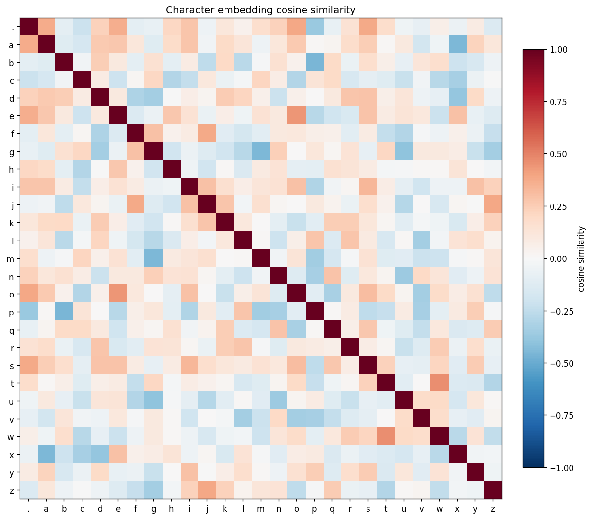
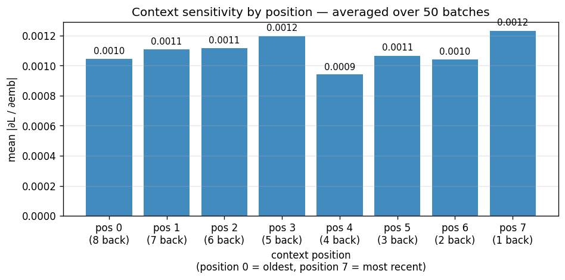

# makemore

A character-level language model series progressing from bigram counts to a
hierarchical WaveNet, with a systematic probing analysis of the learned
phonological representations.

Built as an extension of Karpathy's [makemore](https://github.com/karpathy/makemore)
series. The original contribution of this repository is the representation
analysis in `notebooks/06_probing.ipynb` — what the trained model has
actually learned about the structure of English names — supported by a
modular Python implementation and a manual-backprop verification.

## What the trained model has learned

The WaveNet trained in this repository is a hierarchical character-level
language model with an 8-character receptive field, 76,579 parameters, and a
3-level convolutional structure that builds up from bigram to 4-gram to
full-context features. After 50K training steps it reaches val NLL 2.0128
on the names corpus. The four analyses below characterize what it has
learned about the structure of its inputs.

**Embedding geometry — partial phonological structure.** Cosine similarity
analysis of the 27-character embedding space reveals a robust vowel/non-vowel
distinction: mean vowel-vowel cosine similarity is +0.18 while mean
consonant-consonant similarity is essentially zero (-0.002). The boundary
token `.` sits closest to vowels (cosine = +0.27), consistent with the corpus
bigram statistics where names overwhelmingly start and end with vowel-like
sounds. Finer phonological categories (manner of articulation, place of
articulation) are not clearly visible at 24 embedding dimensions — the PCA
projection used for visualization captures only 22% of the original
variance. The vowel structure is real and well-supported; finer structure
may be present but not detectable by these probing techniques alone.



**Activation distributions — engineering verification.** Histograms of
post-Tanh activations at each of the three hierarchical levels confirm that
the Kaiming + BatchNorm protocol produces stable activation regimes
throughout the deeper architecture. Saturated fractions (|activation| >
0.97) are 9.8% / 12.0% / 5.4% across the bigram, 4-gram, and 8-gram levels
— all well below the 15% diagnostic threshold. A genuine structural finding:
the level-3 distribution is visibly bimodal with mass concentrated *just
inside* the saturation threshold, consistent with the final-level units
operating closer to binary-detector behavior than the intermediate levels.

**Context sensitivity — a surprising flatness.** Gradient magnitude with
respect to each of the 8 context positions reveals a result that contradicts
the natural prior. A naive expectation is that the immediately-preceding
character should dominate the prediction. The measured sensitivity is
*nearly flat* across all 8 positions, with a most-recent/oldest ratio of
only 1.18×. The hierarchical receptive field has redistributed sensitivity
broadly across the context window. Probing alone cannot distinguish between
the available interpretations: (a) the model genuinely uses long-range
information for prediction, (b) the hierarchical aggregation forces every
position to contribute to the final representation regardless of true
causal importance, or (c) gradient magnitude is a coarse proxy for "use" in
deep hierarchical architectures. Distinguishing these requires intervention
experiments that probing cannot provide.



**Single-unit ablation — causal importance concentrates at level 3.** The
top-5 highest-activation neurons at each hierarchical level were
individually zeroed during dev-set evaluation. Knocking out a single
level-3 (8-gram) neuron can increase dev NLL by up to +0.027 nats; the
same operation at the bigram or 4-gram level rarely exceeds +0.006 nats.
This is consistent with — though not definitive proof of — the
architectural design intent: the final hierarchical level integrates all
prior structure into the representation that drives prediction. The
ablation results characterize *importance for overall prediction*, not
specific feature pathways.

**What the analysis does not establish.** No claims are made about which
specific phonological features individual neurons encode. That requires
max-activating-examples analysis plus targeted interventions, which are
out of scope here. The analysis is framed strictly as *probing learned
representations* — characterizing the correlational structure of what the
model has learned, with explicit reporting of methodological limits.
Activation patching and causal scrubbing techniques — which transfer
naturally to transformer architectures with explicit residual streams and
attention — are taken up in the GPT repository that follows this one.

## What it builds

Five models trained on 32K first names, each adding a key architectural
ingredient:

| Model | Key addition | Val NLL | Steps |
|-------|-------------|---------|-------|
| Count bigram | Statistical baseline + Laplace smoothing | 2.4544 | closed-form |
| Neural bigram | Gradient descent on the same model | 2.4623 | 200 steps¹ |
| MLP (Bengio 2003) | Learned embeddings + context window | 2.2957 | 30K steps |
| MLP + Kaiming + BatchNorm | Stable activations, modular layers | 2.1750 | 30K steps |
| Hierarchical WaveNet | Receptive field over `block_size=8` | 2.0128 | 50K steps |

¹ *The neural bigram is fit on a strictly convex objective and converges
reliably to the count bigram's loss within 200 gradient steps; further
training produces no meaningful improvement.*

Step counts are noted because this is not a training benchmark — the artifact
is the implementation and analysis. Karpathy's reference WaveNet result of
~1.99 nats is reached at ~200K steps; the ~0.02-nat gap at 50K steps does
not affect the probing analysis, which characterizes representation
structure that is largely stable once the model has converged to its
general regime.

The neural bigram converges to the same loss as the count bigram by design
— they are two views of the same model class (one fit by enumeration, the
other by gradient descent on a strictly convex objective). The conceptual
bridge matters: every model after the bigram is the same idea (fit
conditional distributions by gradient descent) with progressively richer
parametrizations.

A separate notebook (`04_backprop_ninja.ipynb`) re-trains the MLP+BatchNorm
architecture using only handwritten gradient calculus — no `loss.backward()`
anywhere in the training loop. Every gradient is verified against PyTorch's
autograd via a `cmp()` oracle. The manually-trained model reaches Dev NLL
2.1739, matching the autograd version to ~0.001 nats. This is the proof of
operational understanding: there is nothing in `loss.backward()` that is
not reproducible by hand.

## Run it

```bash
pip install -r requirements.txt
pip install -e .

# Run the progression in order
jupyter notebook notebooks/progression/01_bigram.ipynb
jupyter notebook notebooks/progression/02_mlp.ipynb
jupyter notebook notebooks/progression/03_batchnorm.ipynb
jupyter notebook notebooks/progression/04_backprop_ninja.ipynb
jupyter notebook notebooks/progression/05_wavenet.ipynb

# Then the primary analysis
jupyter notebook notebooks/06_probing.ipynb
```

The probing notebook loads a pre-trained WaveNet checkpoint from
`assets/wavenet.pth` — committed to the repository specifically so the
analysis is standalone-reproducible without re-running the 50K-step
training. The `.gitignore` excludes `.pth` files by default but carves out
an exception for this checkpoint.

## Repository layout

```
makemore/
├── makemore/                   ← reusable Python package
│   ├── data.py                 tokenization, dataset construction, splits
│   ├── layers.py               Linear, BatchNorm1d, Tanh, Embedding,
│   │                           FlattenConsecutive, Sequential
│   └── train.py                training loop, evaluation, sampling
├── models/                     ← model implementations
│   ├── bigram.py               CountBigram, NeuralBigram
│   ├── mlp.py                  Bengio 2003 MLP + LR finder
│   ├── mlp_batchnorm.py        MLP + Kaiming + BatchNorm
│   └── wavenet.py              hierarchical WaveNet + checkpointing
├── notebooks/
│   ├── 06_probing.ipynb        ← primary original contribution
│   └── progression/            ← architectural progression (development arc)
│       ├── 01_bigram.ipynb
│       ├── 02_mlp.ipynb
│       ├── 03_batchnorm.ipynb
│       ├── 04_backprop_ninja.ipynb
│       └── 05_wavenet.ipynb
├── assets/
│   ├── bigram_matrix.png
│   ├── embedding_similarity.png
│   ├── embedding_clusters.png
│   ├── activation_distributions.png
│   ├── context_sensitivity.png
│   └── wavenet.pth             pre-trained model checkpoint
├── data/
│   └── names.txt               32K first names corpus
├── pyproject.toml
├── requirements.txt
└── README.md
```

## Implementation notes

**Why `p.grad = None` rather than `p.grad.zero_()`.** Setting grad to `None`
lets PyTorch skip allocating the gradient tensor on the next forward pass if
the parameter is unused. For the embedding table specifically, only indexed
rows receive gradients — `zero_()` would allocate a dense
`(vocab_size, n_embd)` matrix when a sparse update suffices. At
vocab_size=27 the savings are negligible; the habit matters at vocab sizes
that real language models actually use (50K+).

**Why the bias disappears after BatchNorm.** `BN(Wx + b)` subtracts the
batch mean — the bias `b` is a constant offset that the mean subtraction
cancels exactly. The learnable `β` in BatchNorm plays the role of bias in
the post-normalized space, so keeping `b` in the preceding Linear would add
parameters that contribute nothing the network can't already express. Every
`Linear` immediately preceding a `BatchNorm1d` in this repo uses `bias=False`.

**Why initial logits are scaled toward zero.** Without scaling, the final
linear layer's weights produce logits with standard deviation ≈
`sqrt(fan_in)`, leading to a "confidently wrong" initial softmax and an
initial cross-entropy loss of ~27. Scaling the final layer's weights by 0.01
(MLP+BN) or 0.1 (WaveNet) starts training with near-uniform predictions and
an initial loss of ~`log(27) = 3.30`. The first hundred training steps no
longer need to be spent just undoing initialization.

**What the hierarchical receptive field actually does.** A flat
`FlattenConsecutive(8)` would force the first hidden layer to simultaneously
learn all relationships across the 8-character context, with no notion that
position 0 and position 7 are six positions apart. `FlattenConsecutive(2)`
applied iteratively decomposes this: Layer 1 sees adjacent character pairs,
Layer 2 sees 4-character windows (operating on Layer 1's bigram features),
Layer 3 integrates the full 8-character context. Whether these levels
correspond to phonological units (phonemes, syllable fragments, syllables)
is the question that motivates the probing analysis — and a question that
probing alone cannot fully settle.

**BatchNorm buffer shapes and `nn.Module`.** When not using `nn.Module`,
BatchNorm running buffers acquire a keepdim shape on the first forward pass
(`(1, dim)` for 2D inputs, `(1, 1, dim)` for 3D) that differs from their
`(dim,)` initialization shape — because the EMA update reassigns from
`x.mean(dim, keepdim=True)` whose shape is keepdim-preserving. Saving and
restoring these buffers therefore requires assignment-by-reference rather
than `tensor.copy_()`, which would fail with a shape-mismatch broadcast
error against the freshly-initialized buffer. This is the class of
state-management bug that `nn.Module` handles automatically via
`register_buffer()` — the tradeoff for making the machinery visible is
that you own the edge cases. The fix is implemented in
`models/wavenet.py::load_checkpoint`.

**On probing methodology.** The techniques in `06_probing.ipynb` — cosine
similarity analysis, activation histograms, gradient-based sensitivity,
single-unit ablation — are well-established in the representation learning
literature. They produce *correlational* characterizations of the learned
representations. Causal claims about specific phonological circuits would
require activation patching and similar intervention techniques, which apply
naturally to transformer architectures (with residual streams and attention)
and are taken up in the GPT repository.

## Attribution

Built as an extension of Karpathy's
[makemore](https://github.com/karpathy/makemore) series. The bigram, MLP,
BatchNorm, backprop-ninja, and WaveNet architectures follow his Zero to Hero
videos. The contributions of this repository are: a modular Python package
factoring the layer primitives into reusable components; a manual-backprop
exercise verifying that every gradient in `loss.backward()` is reproducible
by hand; and an original probing analysis of the trained WaveNet's learned
representations with explicit methodological caveats and honest reporting
of ambiguous findings.
